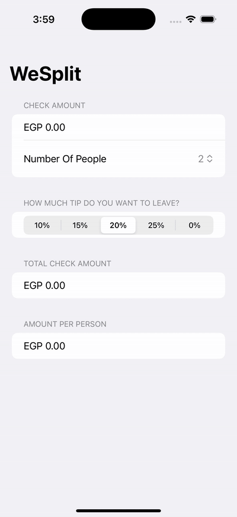

# SwiftUI_MiniApps
A collection of small apps built with SwiftUI. Each app has one or more screens to show different features.

## WeSplit 📱

**WeSplit** is a simple SwiftUI app that allows you to enter a check amount, the number of people, and a tip percentage, then calculates the total and the amount per person.

#### 📸 Demo

